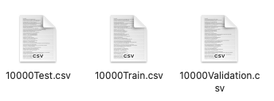
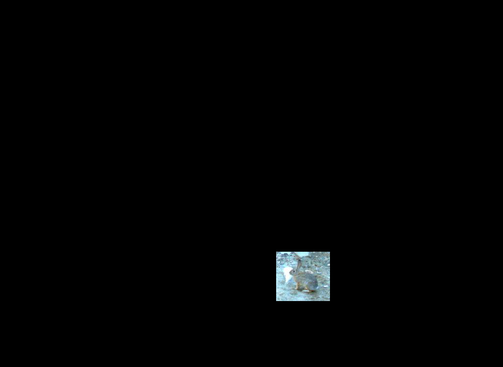
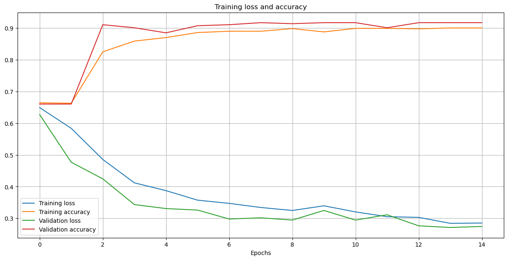

# Aplicación de estrategias de deep-learning para la detección de animales en imágenes de foto trampeo

**Alumno:** Carlos García Silva

**Centro:** Universidad de Huelva (UHU)   
**Titulación:** Grado Ingeniería Informática   
**Departamento:** Ingeniería Electrónica, de Sistemas Informáticos y Automática   
**Área de conocimiento:** Ingeniería de Sistemas y Automática

**Tutor 1:** Diego Marín Santos   
**Tutor 2:** Manuel Emilio Gegúndez Arias

___

# Introducción:

La aplicación de estrategias de Deep Learning (DL) está mostrando gran potencialidad en el análisis de imágenes
digitales de distinta naturaleza. En este TFG se aplican a imágenes adquiridas mediante cámaras de foto trampeo para la
detección de la presencia de animales en las imágenes.

# Objetivos:

Aprendizaje de los fundamentos de las redes neuronales convolucionales (CNN) y su aplicación mediante la librería
TensorFlow de Python. Revisión del estado del arte, diseño e implementación de CNN en el problema de experimentación
planteado. Análisis y evaluación de resultados.

# Requisitos previos:

- Python: v3.8
- TensorFlow: v2.10.0 GPU (En nuestro entorno macOS con Apple Silicon)
- Repositorio [CameraTraps](https://github.com/microsoft/CameraTraps) de Microsoft, que hemos incluido en la
  carpeta [repos](https://github.com/byLiTTo/TFG-DeteccionFototrampeo/tree/main/repos) de nuestro repositorio
- Repositorio [ai4eutils](https://github.com/microsoft/ai4eutils) de Microsoft, que hemos incluido en la
  carpeta [repos](https://github.com/byLiTTo/TFG-DeteccionFototrampeo/tree/main/repos) de nuestro repositorio
- Modelo
  MegaDetector: [megadetector_v4_1_0.pb](https://lilablobssc.blob.core.windows.net/models/camera_traps/megadetector/md_v4.1.0/md_v4.1.0.pb)

# Librerías de Python utilizadas:

Si al ejecutar los notebooks, sucede algún tipo de error, asegúrese de tener instaladas las siguientes librerías en su
entorno:

| Nombre        | Versión |     | Nombre           | Versión |     | Nombre           | Versión |
|---------------|---------|-----|------------------|---------|-----|------------------|---------|
| humanfriendly | 10.0    |     | jsonpickle       | 2.2.0   |     | jupyterlab       | 3.4.4   |
| matplotlib    | 3.5.2   |     | numpy            | 1.23.1  |     | opencv           | 4.6.0   |
| pandas        | 1.4.4   |     | pillow           | 9.2.0   |     | python           | 3.8.13  |
| scikit-learn  | 1.1.1   |     | tensorflow-macos | 2.10.0  |     | tensorflow-metal | 0.6.0   |

  

  
  

  
  

  
  

  
  

  

  

  

Para mayor facilidad hemos creado una carpeta donde guardaremos copias de seguridad de los entornos que vayamos creando
a medida que completemos proyecto. Cada vez que instalemos una nueva librería o actualicemos la versión de las ya
existentes subiremos una copia de seguridad. La carpeta en cuestión
es [TFG-DeteccionFototrampeo/env](https://github.com/byLiTTo/TFG-DeteccionFototrampeo/tree/main/env).

___

# Ejecutar aplicación

En la creación de la aplicación hemos implementado varios notebooks, cada uno de ellos ejecuta cada una de las fases
que forman el proyecto global. Lo hemos realizado de esta manera para una mejor gestión de las nuevas funcionalidades
que se añadían a medida que se avanzaba el desarrollo.

Para realizar este proyecto, se nos ha facilitado un dataset con imágenes de foto trampeo de diferentes especies de
animales, humanos y vehículos, capturadas en los parajes
del [Parque natural de Doñana](https://es.wikipedia.org/wiki/Parque_nacional_y_natural_de_Doñana). La forma de manejar
los datos es a través de un fichero CSV, donde en una columna se nos indica la ruta del fichero correspondiente a la
imagen y en su segunda columna se nos dice a qué clase pertenece dicha imagen.

  

___

# Notebooks principales:

Como hemos mencionado anteriormente, para cada funcionalidad se ha intentado crear un notebook que la ejecute, por
algunos de ellos no necesitan ser ejecutados para obtener los resultados. A continuación, vamos a explicar la
funcionalidad de cada uno, así como el orden de ejecución.

## a01_GeneraDataset

En el dataset existen varias especies de animales, en nuestro proyecto, por el momento solo nos
interesa identificar la presencia de animales, por lo que solo nos serán necesarias dos clases _Animal_ o _Vacía_.
Además, en nuestro caso queríamos trabajar con un dataset de valores binarios para las clases, lo que tuvimos que
realizar una conversión previa, en la que:

- Indicamos la nomenclatura de las clases originales (variable _ORIGINAL_CLASSES_).
- Nomenclaturas que formarán la nueva clase _ANIMAL_ (variable _CLASS_ANIMAL_).
- Nomenclaturas que formarán la nueva clase _VACÍA_ (variable _CLASS_EMPTY_).

Para hacer funcionar el notebook de forma correcta, deberemos indicar:

- Localización del fichero CSV de origen, indicada en la variable _dataset_csv_relative_.
- Localización donde se guardarán los ficheros CSV fraccionados, indicada en la variable _custom_csv_relative_.
- Número de muestras de la clase _VACÍA_, indicada en la variable _NUMBER_IMAGES_.
- Porcentaje de muestras de la clase _VACÍA_ para el CSV de entrenamiento, indicada en la variable _TRAIN_PERCENTAGE_.
- Porcentaje de muestras de la clase _VACÍA_ para el CSV de validación, indicada en la variable _VALIDATION_PERCENTAGE_.
- Porcentaje de muestras de la clase _VACÍA_ para el CSV de test, indicada en la variable _TEST_PERCENTAGE_.

Si lo deseamos podemos hacer una partición del número de muestras de la clase vacía, en nuestro caso hemos hecho una de
700 muestras y otra para el tamaño original de 10000 muestras.

El dataset quedará dividido en tres partes, _Train_, _Validation_ y _Test_. Por cada uno generamos un CSV con el mismo
formato que el original. Estos ficheros que guardarán por defecto en la
carpeta [TFG-DeteccionFototrampeo/data](https://github.com/byLiTTo/TFG-DeteccionFototrampeo/tree/main/data).

  

## a02_GeneraDetecciones

A la hora de procesar las imágenes el primer paso es generar las detecciones. Para ello hemos decidido hacer uso de
Megadetector, un modelo de detección de objetos desarrollado por Microsoft disponible
en su repositorio [CameraTraps](https://github.com/microsoft/CameraTraps).

  

Para hacer funcionar el notebook de forma correcta, deberemos indicar:

- Localización del dataset, indicada en la variable _dataset_dir_relative_.
- Localización del fichero CSV de donde se obtendrán las rutas de las imágenes, indicada en la variable _
  csv_file_relative_.
- Localización donde se guardarán los ficheros JSON con los resultados, indicada en la variable
  _output_json_path_relative_.
- Localización del modelo Megadector, indicada en la variable _model_relative_.

De forma predeterminada, los ficheros CSV serán tomados desde la
carpeta [TFG-DeteccionFototrampeo/data](https://github.com/byLiTTo/TFG-DeteccionFototrampeo/tree/main/data).

Una vez obtenidos los resultados, se generará un fichero JSON con los datos de cada detección encontrada en cada una de
las imágenes. Se generan tanto un JSON global que contiene todos los resultados de la ejecución, así como un fichero
JSON por cada imagen de forma individual, con el siguiente formato:

~~~
{
  "file": "/Users/carlos/WORKSPACE/DATASETs/emptyNonEmptyDataset/jabali/WILDBOAR_ZOO_1_4/1_20210115 (500).JPG",
  "max_detection_conf": 0.999,
  "detections": [
  {
  "category": "1",
  "conf": 0.999,
  "bbox": [
    0.4826,
    0.5632,
    0.08033,
    0.0982
  ]
  }
 ],
 "detection_categories": {
  "1": "animal",
  "2": "person",
  "3": "vehicle"
 }
}
~~~

Todos estos resultados son guardados en la
carpeta [TFG-DeteccionFototrampeo/output_json](https://github.com/byLiTTo/TFG-DeteccionFototrampeo/tree/main/output_json)
,
para los ficheros de resultados globales, hemos creado una carpeta dentro de la anteriormente mencionada, a modo de
historial, se trata
de [TFG-DeteccionFototrampeo/registry](https://github.com/byLiTTo/TFG-DeteccionFototrampeo/tree/main/output_json/registry)
.

Adicionalmente, hemos implementado una forma alternativa de aportar la entrada a MegaDetector. Se trata de indicar
directamente la imagen o carpeta con varias imágenes, de las cuales se quiere generar las detecciones. (Por defecto
hemos creado la
carpeta [TFG-DeteccionFototrampeo/input](https://github.com/byLiTTo/TFG-DeteccionFototrampeo/tree/main/input) para que
tome las imágenes).

### b01_GeneraMascaras

Crearemos imágenes binarias donde los píxeles de valor 255 corresponderán a los píxeles de las regiones de interés, en
este caso, los bounding boxes de las detecciones ya calculadas. Por otro lado, los píxeles de valor 0, no representarán
interés alguno. A estas imágenes las denominaremos _Máscaras_ y por defecto se guardarán en la
carpeta [TFG-DeteccionFototrampeo/output_mask](https://github.com/byLiTTo/TFG-DeteccionFototrampeo/tree/main/output_mask)
.

  

Para hacer funcionar el notebook de forma correcta, deberemos indicar:

- Localización de los ficheros JSON con detecciones, indicada en la variable _output_json_path_relative_.
- Localización de la carpeta donde se guardarán las máscaras, indicada en la variable _output_mask_path_relative_.

Por defecto, se tomarán los ficheros JSON de la
carpeta [TFG-DeteccionFototrampeo/output_json](https://github.com/byLiTTo/TFG-DeteccionFototrampeo/tree/main/output_json)
.

### c01_AplicaMascaras

Una vez generadas las máscaras, deberemos aplicarlas a las imágenes originales, con el fin de tener en las regiones de
interés, los valores de los píxeles reales. El resultado de este proceso será una nueva imagen donde tendremos un fondo
negro y los píxeles de la imagen original en las regiones de interés. Estos resultados serán guardados por defecto en la
carpeta [TFG-DeteccionFototrampeo/output_masked](https://github.com/byLiTTo/TFG-DeteccionFototrampeo/tree/main/output_masked)
.

  

Para hacer funcionar el notebook de forma correcta, deberemos indicar:

- Localización de los ficheros JSON, indicada en la variable _output_json_path_relative_.
- Localización de las máscaras, indicada en la variable _output_mask_path_relative_.
- Localización de la carpeta donde se guardarán las imágenes enmascaradas, indicada en la variable
  _output_masked_path_relative_.

### d01_AjustaImagenes

Comprobando las imágenes resultantes, observamos que en muchas de ellas, las zonas de interés conformaban un porcentaje
de píxeles de la imagen muy pequeño. Por lo que en fases futuras podría existir un desaprovechamiento de la información.
Decidimos realizar una serie de ajustes previos a las imágenes antes de aportarlas como entrada al entrenamiento de la
CNN.

  

Ajustes realizados:

- Quitar los bordes negros, ajustando las detecciones a los límites de la imagen.
- Centrando las detecciones, cambiar la proporción de la imagen a cuadrada, añadiendo el número de píxeles necesarios
  alrededor (píxeles de valor 0).

  
  

## a03_EntrenaClasificador

  

~~~
Entrenamiento CNN AÚN EN DESARROLLO
~~~

___

# Funcionalidades Adicionales

### b02_GeneraRecortes

Uno de los planteamientos alternativos que planteamos al comienzo del proyecto, fue el tipo de imagen que daríamos como
entrada a la CNN.

Planteamos dos escenarios, el primero donde dábamos como entrada una imagen donde tendríamos a color,
únicamente las zonas que abarcasen los bounding boxes de las detecciones y el resto en negro (Hasta el momento este está
siendo el planteamiento principal).

El segundo, trata de dar como entrada a la red, imágenes que corresponden a las diferentes detecciones de cada imagen
original, es decir, si de una imagen obteníamos 3 detecciones, tras ejecutar este proceso obtendremos 3 ficheros de
imagen diferentes, recortando en cada uno, una detección diferente.

Para hacer funcionar el notebook de forma correcta, deberemos indicar:

- Localización de los ficheros JSON, indicada en la variable _output_json_path_relative_.
- Localización de carpeta destino donde se guardarán las imágenes recortadas, indicada en la variable
  _output_crop_path_relative_.

  
  

La carpeta de origen por defecto
será [TFG-DeteccionFototrampeo/output_json](https://github.com/byLiTTo/TFG-DeteccionFototrampeo/tree/main/output_json).

De forma predeterminada, la carpeta destino donde se guardarán los recortes,
será [TFG-DeteccionFototrampeo/output_crop](https://github.com/byLiTTo/TFG-DeteccionFototrampeo/tree/main/output_crop).

### b03_GeneraBoundingBoxes

A la hora de comprobar imágenes en concreto, quisimos implementar una funcionalidad de comprobar de forma rápida los
bounding boxes sobre las imágenes originales. Además de que esta funcionalidad es la que traía por defecto Megadetector,
por lo que la exportamos en un módulo individual, separado del resto. El resultado de la ejecución es una copia de la
imagen original donde se pueden ver dibujados los bounding boxes de las detecciones dentro de un rango de umbral
seleccionado, además de porcentaje de pertenencia a las clases que es capaz de clasificar Megadetector.

Para hacer funcionar el notebook de forma correcta, deberemos indicar:

- Localización de los ficheros JSON, indicada en la variable _output_json_path_relative_.
- Localización de carpeta destino donde se guardarán las imágenes generadas, indicada en la variable
  _output_img_path_relative_.

  

La carpeta de origen por defecto
será [TFG-DeteccionFototrampeo/output_json](https://github.com/byLiTTo/TFG-DeteccionFototrampeo/tree/main/output_json).

De forma predeterminada, la carpeta destino donde se guardarán las imágenes generadas,
será [TFG-DeteccionFototrampeo/output_img](https://github.com/byLiTTo/TFG-DeteccionFototrampeo/tree/main/output_img).

___
